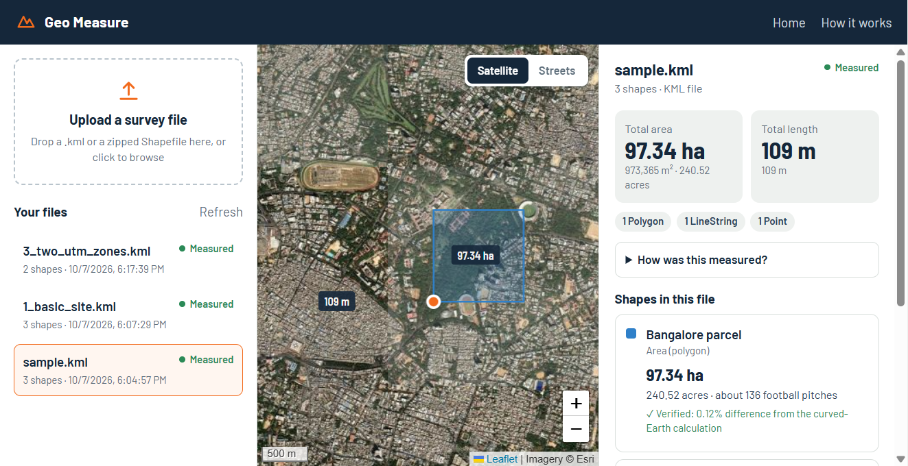
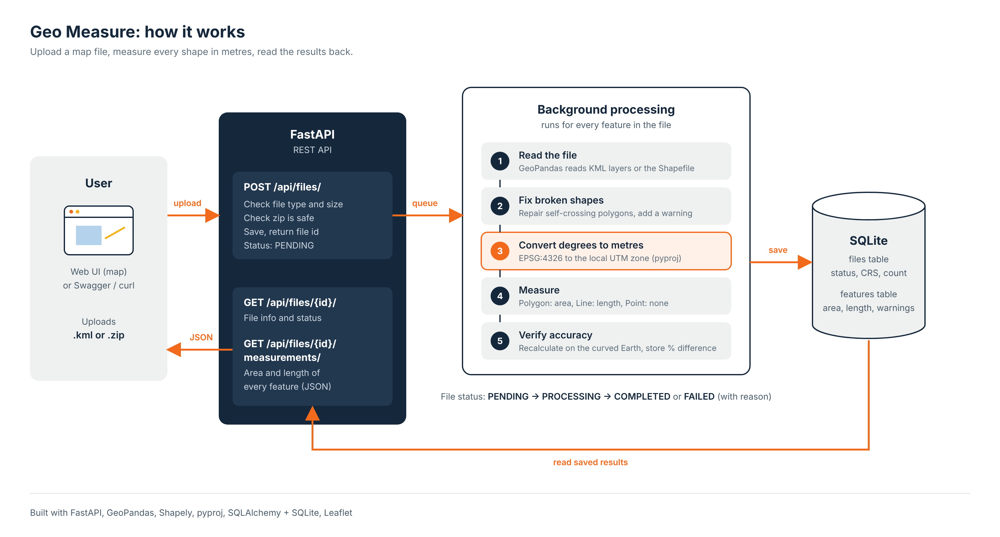

# Geo Measure API

Upload a map file (**KML** or a zipped **Shapefile**) and get the **area** of every polygon and the **length** of every line, in metres, hectares and acres.

Built with **FastAPI, GeoPandas, Shapely, pyproj and SQLite**, with a simple web UI that shows the results on a map.




---

## Features

- Upload `.kml` or `.zip` (Shapefile) files
- Area for polygons, length for lines; points are listed without measurements
- **Correct CRS handling:** shapes are converted from GPS degrees to metres (UTM) before measuring
- **Accuracy check:** every result is compared with a curved-Earth (geodesic) calculation
- Broken shapes (e.g. self-crossing polygons) are repaired and flagged
- Unsupported or invalid files return a clear error, never a crash
- Web UI with satellite map, measurement labels and upload history
- 25 automated tests, plus Docker support

---

## Setup

```bash
python -m venv .venv
# Windows: .\.venv\Scripts\Activate.ps1    Mac/Linux: source .venv/bin/activate
pip install -r requirements.txt
uvicorn app.main:app --reload
```

The service listens at `http://127.0.0.1:8000`.
Docker:

```powershell
docker build -t geo-measure-api .
docker run --rm -p 8000:8000 -v geo-measure-data:/app/data geo-measure-api
```

Run tests and regenerate example files:

```powershell
pytest
python scripts/generate_samples.py
```

## API

| Method | Endpoint | Description |
|---|---|---|
| `POST` | `/api/files/` | Upload a `.kml` or `.zip` file |
| `GET` | `/api/files/{id}/` | File info and processing status |
| `GET` | `/api/files/{id}/measurements/` | Measurements for every feature |
| `GET` | `/api/files/` | List uploaded files |

### 1. Upload
```bash
curl -F "file=@sample_data/sample.kml" http://127.0.0.1:8000/api/files/
```
```json
{ "id": "9f368b08-bcf9-4182-98b5-cd64e9c9ad95", "status": "PENDING", "duplicate": false }
```
The file is processed in the background. Uploading the same file again returns the saved result (`"duplicate": true`).

### 2. File info
```bash
curl http://127.0.0.1:8000/api/files/{id}/
```
```json
{
	"id": "9f368b08-bcf9-4182-98b5-cd64e9c9ad95",
	"filename": "sample.kml",
	"feature_count": 3,
	"crs": "EPSG:4326",
	"projected_crs_used": "EPSG:32643",
	"status": "COMPLETED"
}
```
Status goes `PENDING → PROCESSING → COMPLETED` (or `FAILED` with an `error_message`).

### 3. Measurements
```bash
curl http://127.0.0.1:8000/api/files/{id}/measurements/
```
```json
{
	"summary": {
		"total_area_m2": 973365.15,
		"total_area_hectares": 97.3365,
		"total_length_m": 108.56,
		"counts_per_geometry_type": { "Polygon": 1, "LineString": 1, "Point": 1 }
	},
	"features": [
		{
			"feature_id": 0,
			"geometry_type": "Polygon",
			"crs": "EPSG:4326",
			"properties": { "Name": "Bangalore parcel" },
			"geometry": { "type": "Polygon", "coordinates": [[[77.59, 12.97], [77.599, 12.97], "..."]] },
			"measurements": {
				"area_m2": 973365.15,
				"area_hectares": 97.3365,
				"area_acres": 240.5238,
				"geodesic_area_m2": 972236.68,
				"difference_percent": 0.1161
			},
			"warnings": []
		}
	]
}
```
(Shortened. Lines return `length_m`, and points return `measurements: null`.)

### Errors
All errors return JSON: `{ "detail": "message" }`

| Case | Response |
|---|---|
| Wrong file type / empty file / unsafe zip | `400` |
| File too large (over 50 MB) | `413` |
| Unknown file id | `404` |
| Measurements requested while still processing | `409` |
| File could not be read (e.g. zip missing `.dbf`) | Status `FAILED` with a reason |

## Architecture



**How it works:**

1. **Upload:** the user uploads a `.kml` or `.zip` file from the web UI, Swagger or curl to `POST /api/files/`.
2. **Validate:** FastAPI checks the file type, size and zip safety, saves the file, and returns a file `id` straight away (status `PENDING`).
3. **Process in the background:** for every feature in the file:
   - **Read** it with GeoPandas
   - **Fix** broken shapes (e.g. self-crossing polygons) and add a warning
   - **Convert** coordinates from degrees (EPSG:4326) to metres in the local UTM zone
   - **Measure** the area of polygons and the length of lines (points have no measurement)
   - **Verify** the result against a curved-Earth (geodesic) calculation
4. **Save:** results are stored in SQLite and the status becomes `COMPLETED`, or `FAILED` with a reason.
5. **Read results:** `GET /api/files/{id}/` returns the file status, and `GET /api/files/{id}/measurements/` returns the measurements as JSON.

### Project structure
```
app/
├── main.py              # FastAPI app, serves the web UI
├── routes/files.py      # API endpoints
├── services/
│   ├── file_reader.py   # Safely reads KML / unzips Shapefiles
│   ├── crs.py           # Picks the right metric CRS for each shape
│   ├── measurements.py  # Area, length, geodesic check, shape repair
│   └── processor.py     # Runs the full pipeline in the background
├── models.py            # Database tables (files, features)
├── schemas.py           # API response formats
└── static/              # Web UI (HTML, CSS, JS)
tests/                   # pytest tests
sample_data/             # Example KML and Shapefile
```

### CRS handling
Coordinates in longitude and latitude are angles, not distances. A degree of longitude is about 111 km at the equator and approaches zero at the poles, so calculating planar area or length directly in degrees is wrong.

For each geographic feature, the service selects the UTM zone containing that feature's centroid and uses EPSG:326xx in the north or EPSG:327xx in the south. That allows one file to span UTM zones without forcing every feature into a single projection. Features wider than six degrees use Lambert Azimuthal Equal Area centered on the feature; polar features also use a local LAEA projection. Already projected data stays in its source CRS, with axis-unit conversion when the CRS uses feet.

Projected Mercator-family inputs such as Web Mercator (EPSG:3857) are an exception: their scale distortion grows with latitude, so the feature is transformed to WGS84 and measured in a per-feature UTM or LAEA CRS. The source is identified from its coordinate-operation method, while Transverse Mercator CRSs such as UTM remain unchanged. A warning records the CRS used for measurement.

The geometry is also transformed to EPSG:4326 and measured on the WGS84 ellipsoid with `pyproj.Geod`. The percentage difference from the projected result is returned, and differences above 0.5% add a warning. Missing CRS metadata is assumed to be EPSG:4326 only when all coordinates pass longitude/latitude bounds checks.

## Design Decisions

| Decision | Why | Alternative considered |
|---|---|---|
| **FastAPI** | Lightweight, fast, built-in validation and Swagger docs | Django: more setup than this API needs |
| **SQLite** | Zero setup, easy to run and test | PostGIS: better for spatial queries at scale |
| **Background tasks** | Upload returns instantly; big files don't block | Celery + Redis: more reliable but heavier |
| **UTM per feature + geodesic check** | Accurate metric results, verified a second way | Single CRS for whole file: inaccurate across regions |
| **Repair invalid shapes** | Real survey data is messy; still give a useful result | Rejecting the file: less helpful |
| **File hash deduplication** | Same file isn't processed twice | Always reprocess: wasted work |

---

## Testing

`pytest` runs 25 tests with generated sample data. They cover:
- A 1 km × 1 km square measures ≈ 1,000,000 m²
- Lines of known length
- Multiple UTM zones and the southern hemisphere
- Web Mercator input
- Self-crossing shape repair
- Missing CRS
- Invalid, empty and unsafe files
- All API status codes

---

## Learnings

- Why measuring in lat/long degrees is wrong, and how map projections fix it
- Real files are messy: invalid shapes, missing `.prj` files and 3D coordinates need handling
- Zip uploads must be checked for safety (zip-slip, zip bombs) *before* extracting
- A background task needs its own database session

## Future Scope

- Compare surveys for change detection and encroachment analysis.
- Move metadata and spatial features to PostGIS.
- Run durable Celery/Redis workers and store uploads in S3-compatible object storage.
- Add GeoJSON and GeoPackage input and DEM-based volume calculations.
- Add authentication, quotas, and rate limiting.
