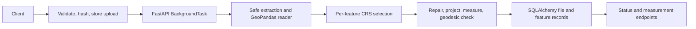

# Geo Measure API

A FastAPI service that safely reads KML and zipped Shapefiles, measures each feature in metric units, and stores results in SQLite.


Highlights: upload hashing and deduplication, background processing, safe ZIP extraction, per-feature projected CRS selection, geometry repair, and projected-versus-geodesic accuracy checks.

## Quick Start

Use Python 3.11 or newer locally. The container uses Python 3.12.

### Windows (PowerShell)

```powershell
python -m venv .venv
.\.venv\Scripts\Activate.ps1
python -m pip install -r requirements.txt
uvicorn app.main:app --reload
```

### Linux/macOS (bash)

```bash
python3 -m venv .venv
source .venv/bin/activate
python -m pip install -r requirements.txt
uvicorn app.main:app --reload
```

The service listens at `http://127.0.0.1:8000`; Swagger UI is at `http://127.0.0.1:8000/docs`. By default, SQLite data lives in `data/geo_measure.db` and uploads are stored temporarily under `uploads/`. Set `DATABASE_URL` and `UPLOAD_DIR` to change these locations.

Open http://127.0.0.1:8000/ for the homepage. Upload a file there and it opens in the map workspace (/app).

Docker:

```powershell
docker build -t geo-measure-api .
docker run --rm -p 8000:8000 -v geo-measure-data:/app/data geo-measure-api
```

Run tests and regenerate example files:

```powershell
pytest
python scripts/generate_samples.py
```

## API Reference

All errors use a JSON `detail` string. Uploads are limited to 50 MB. The sample values below were returned by running the checked-in sample files through the app.

### `POST /api/files/`

Upload a `.kml` or `.zip` containing exactly one Shapefile. The multipart field is `file`. New files return `202` with their initial `PENDING` status. Processing continues in the background, so poll the file endpoint until it reports `COMPLETED` or `FAILED`.

```bash
curl -F "file=@sample_data/sample.kml" http://localhost:8000/api/files/
```

Example upload response:

```json
{"id":"c42db5f1-41f8-4e0b-b1ab-442beffabcad","status":"PENDING","duplicate":false}
```

Uploading the same bytes again returns HTTP `200`, the original `id`, and `"duplicate": true`.

### `GET /api/files/{id}/`

```bash
curl http://localhost:8000/api/files/c42db5f1-41f8-4e0b-b1ab-442beffabcad/
```

```json
{
	"id": "c42db5f1-41f8-4e0b-b1ab-442beffabcad",
	"filename": "sample.kml",
	"file_type": "kml",
	"feature_count": 3,
	"crs": "EPSG:4326",
	"projected_crs_used": "EPSG:32643",
	"status": "COMPLETED",
	"error_message": null,
	"created_at": "2026-10-07T11:55:43",
	"completed_at": "2026-10-07T11:55:43.889821"
}
```

### `GET /api/files/{id}/measurements/`

Use `?geometry_type=Polygon` to filter the feature list and summary counts.
Each returned `feature_id` is the zero-based feature index within that upload, not a database identifier.

```bash
curl "http://localhost:8000/api/files/c42db5f1-41f8-4e0b-b1ab-442beffabcad/measurements/"
```

Real sample summary and polygon feature excerpt:

```json
{
	"file_id": "c42db5f1-41f8-4e0b-b1ab-442beffabcad",
	"filename": "sample.kml",
	"crs": "EPSG:4326",
	"projected_crs_used": "EPSG:32643",
	"summary": {
		"total_area_m2": 973365.15,
		"total_area_hectares": 97.3365,
		"total_area_acres": 240.5238,
		"total_length_m": 108.56,
		"total_length_km": 0.1086,
		"counts_per_geometry_type": {"Polygon": 1, "LineString": 1, "Point": 1},
		"unsupported_feature_count": 0,
		"repaired_feature_count": 0
	},
	"features": [
		{
			"feature_id": 0,
			"geometry_type": "Polygon",
			"crs": "EPSG:4326",
			"properties": {"Name": "Bangalore parcel", "Description": ""},
			"geometry": {"type": "Polygon", "coordinates": [[[77.59, 12.97], [77.599, 12.97], [77.599, 12.979], [77.59, 12.979], [77.59, 12.97]]]},
			"measurements": {
				"area_m2": 973365.15,
				"area_hectares": 97.3365,
				"area_acres": 240.5238,
				"length_m": null,
				"length_km": null,
				"geodesic_area_m2": 972236.68,
				"geodesic_length_m": null,
				"difference_percent": 0.1161
			},
			"is_supported": true,
			"warnings": []
		}
	]
}
```

The response includes every matching feature. Point features are supported and have `measurements: null`.

### `GET /api/files/`

List uploads with `limit` (1–100) and `offset` pagination:

```bash
curl "http://localhost:8000/api/files/?limit=20&offset=0"
```

### `GET /health`

```bash
curl http://localhost:8000/health
```

```json
{"status":"ok"}
```

The zipped sample was also rerun against the live server:

```bash
curl -F "file=@sample_data/sample_shapefile.zip" http://localhost:8000/api/files/
```

```json
{"id":"7649305e-7fb1-43c6-bf61-012ccdc4d5ec","status":"PENDING","duplicate":false}
```

After polling `GET /api/files/7649305e-7fb1-43c6-bf61-012ccdc4d5ec/`, it completed with one polygon in EPSG:4326, measured in EPSG:32643:

```json
{"id":"7649305e-7fb1-43c6-bf61-012ccdc4d5ec","filename":"sample_shapefile.zip","file_type":"shapefile","feature_count":1,"crs":"EPSG:4326","projected_crs_used":"EPSG:32643","status":"COMPLETED","error_message":null,"created_at":"2026-10-07T11:55:43","completed_at":"2026-10-07T11:55:43.998220"}
```

Its measurement response uses `feature_id: 0` and reports `973365.15` square meters (`97.3365` hectares, `240.5238` acres); the geodesic area is `972236.68` square meters, a `0.1161%` difference.

## Architecture



`app/main.py` creates tables at startup. `routes/files.py` validates requests and schedules processing. `services/file_reader.py` reads each KML layer or safely extracts one Shapefile. `services/processor.py` owns the `PENDING -> PROCESSING -> COMPLETED/FAILED` lifecycle using its own session. The CRS and measurement services work on one feature at a time. SQLAlchemy stores upload status and JSON feature data.

### Web UI

Static HTML/CSS/vanilla JS is served by FastAPI `StaticFiles`; there is no build step. The page uploads the file, polls `GET /api/files/{id}/` every second until `COMPLETED` or `FAILED`, then loads `/measurements/` and draws features on a Leaflet map. Features whose coordinates are not longitude/latitude (projected source CRS) are listed but not drawn.

The homepage at `/` explains the service and uploads files, polls their status, then redirects to `/app?file=<id>`. The workspace at `/app` reads the `?file=` parameter and opens that file directly; without it, the workspace shows the existing files list.

## CRS Strategy

Coordinates in longitude and latitude are angles, not distances. A degree of longitude is about 111 km at the equator and approaches zero at the poles, so calculating planar area or length directly in degrees is wrong.

For each geographic feature, the service selects the UTM zone containing that feature's centroid and uses EPSG:326xx in the north or EPSG:327xx in the south. That allows one file to span UTM zones without forcing every feature into a single projection. Features wider than six degrees use Lambert Azimuthal Equal Area centered on the feature; polar features also use a local LAEA projection. Already projected data stays in its source CRS, with axis-unit conversion when the CRS uses feet.

Projected Mercator-family inputs such as Web Mercator (EPSG:3857) are an exception: their scale distortion grows with latitude, so the feature is transformed to WGS84 and measured in a per-feature UTM or LAEA CRS. The source is identified from its coordinate-operation method, while Transverse Mercator CRSs such as UTM remain unchanged. A warning records the CRS used for measurement.

The geometry is also transformed to EPSG:4326 and measured on the WGS84 ellipsoid with `pyproj.Geod`. The percentage difference from the projected result is returned, and differences above 0.5% add a warning. Missing CRS metadata is assumed to be EPSG:4326 only when all coordinates pass longitude/latitude bounds checks.

## Design Decisions

- **FastAPI over Django:** this assignment is a focused JSON API; FastAPI provides async uploads, typed request validation, background tasks, and generated OpenAPI without a larger admin stack.
- **SQLite over PostGIS:** SQLite keeps setup and local testing simple. PostGIS is a natural next step for spatial querying, concurrency, and larger datasets.
- **BackgroundTasks over Celery/Redis:** built-in tasks satisfy this single-process assignment. They are not durable across process restarts; a queue is preferable for production workloads.
- **Per-feature UTM/LAEA plus geodesic checks:** local projected CRS values provide practical metric measurements; the ellipsoidal calculation provides a separate accuracy check. A single projection can distort distant features, while geodesic-only measurement is less convenient for projected-source unit handling and broader planar operations.
- **GeoJSON stored as JSON:** feature geometries remain portable and easy to return. A spatial database is better for indexing and spatial predicates at scale.
- **SHA-256 deduplication:** identical successful uploads reuse their existing record; failed jobs may be retried by uploading the same bytes.
- **`make_valid` instead of rejecting all invalid shapes:** recoverable geometry errors can still produce useful output, with the original validity reason retained as a warning.

## Edge Cases

- Reject unsupported extensions, empty uploads, corrupt ZIPs, excessive upload sizes, zip-slip paths, symbolic links, duplicate archive paths, oversized extraction totals, too many archive entries, and ambiguous multiple Shapefiles.
- Require `.shp`, `.shx`, and `.dbf`; report a missing `.prj` and validate coordinates before assuming WGS84.
- Reproject Mercator-family sources before measuring area; do not apply that rule to Transverse Mercator/UTM sources.
- Read all KML layers and discard Z coordinates.
- Merge Google Earth `ExtendedData` and nested Folder names by Placemark order; skip the merge with a warning if the Placemark and feature counts differ.
- Repair invalid geometries, retain unsupported and empty geometries without crashing, and handle points without inventing measurements.
- Return `409` for measurements while processing, `422` for failed processing, and `404` for unknown IDs.

## Testing

The test suite programmatically generates KML and Shapefile data and uses a temporary SQLite database. It covers one-square-kilometer accuracy, known line length, points, self-intersection repair, multiple UTM zones, southern UTM, projected feet, Web Mercator distortion, missing CRS, wide-feature LAEA, KML ExtendedData and folder metadata, zero-based feature IDs, API uploads, deduplication, pagination, status gates, and invalid/unsafe archives.

Run it with `pytest`.

## Learnings

- Reprojection must happen per feature when one upload may cover multiple zones.
- A projected measurement is easier to interpret when checked independently against an ellipsoidal result.
- ZIP file names and expansion sizes must be checked before extraction, not after.
- A background task must use a fresh database session because the request-scoped session is already closing.

## Future Scope

- Compare surveys for change detection and encroachment analysis.
- Move metadata and spatial features to PostGIS.
- Run durable Celery/Redis workers and store uploads in S3-compatible object storage.
- Add GeoJSON and GeoPackage input and DEM-based volume calculations.
- Add authentication, quotas, and rate limiting.